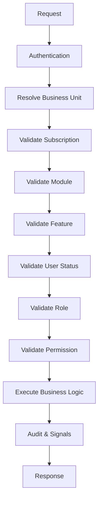

# B29 - Runtime Authorization & Capability Resolution

This document serves as the definitive Runtime Bible for YSS Orbit. It outlines the sequence, strategy, and architecture used to resolve capabilities and validate requests across the enterprise platform.

## 1. Runtime Flow

Every secured API request undergoes a strict, top-down security validation sequence.

## 2. Authentication

Requests are first authenticated via Token or Session based authentication (typically JWT in DRF). The principal (`request.user`) must be authenticated and active.

## 3. Business Unit Resolution

YSS Orbit is a multi-tenant platform. The request must supply a valid Business Unit context (often via headers `X-Business-Unit-ID` or parsed from the URL).
- The user must hold an active `UserRole` membership mapping them to this specific Business Unit.

## 4. Module Validation

Using the declared `required_module` on the view:
- The system checks `BusinessUnitModule` to confirm the resolved BU holds an active license/subscription to the requested Module.

## 5. Feature Validation

Using the declared `required_feature` on the view:
- The system verifies `BusinessUnitFeature` to ensure the granular feature is licensed.
- If the feature has dependencies (`FeatureDependency`), they must implicitly be resolved.

## 6. Permission Validation

Using the declared `required_permission` on the view (e.g., `payroll.salary.manage`):
- The `UserRole` for the context is evaluated.
- The `Role` is inspected for the presence of the mapped `Permission`.
- Explicit `UserPermissionOverride` records may act as explicit ALLOW or DENY.

## 7. Cache Strategy

Capability checks (Module, Feature, Role, Permission) are heavily cached in Redis per Business Unit and User.
- Cache Keys are invalidated via Django Signals whenever a registry mutation occurs (e.g. `RoleUpdated`, `SubscriptionActivated`).

## 8. Audit Strategy

Every authorized request that performs a mutation (POST, PUT, PATCH, DELETE) automatically triggers an Audit Log containing:
- User ID
- Business Unit ID
- Timestamp
- API Resource
- Action/Method
- Payload diff (if configured)

## 9. Error Responses

Standardized error codes apply:
- `401 Unauthorized`: Missing or invalid authentication token.
- `403 Forbidden`: Authentication succeeded, but Capability/RBAC validation failed.
  - Returns explicit error details (e.g., "Module License Expired", "Insufficient Permissions").
- `404 Not Found`: Avoid leaking data existence to unauthorized users by using 404 instead of 403 on specific object-level access checks.

## 10. Signals (Phase 1 Event Architecture)

YSS Orbit relies on Django Signals for synchronous event publishing within the monolith.

Core Signals emitted include:
- **BusinessUnit**: `BusinessUnitCreated`, `BusinessUnitArchived`
- **Licensing**: `ModuleLicensed`, `ModuleUnlicensed`, `FeatureEnabled`, `FeatureDisabled`, `SubscriptionActivated`, `SubscriptionExpired`
- **RBAC**: `RoleCreated`, `RoleUpdated`, `PermissionAssigned`, `PermissionRevoked`

These signals are responsible for:
- Writing to the Audit Log.
- Clearing Redis Security Caches.
- Sending asynchronous notifications.

## 11. Future Event Bus (Phase 2)

As YSS Orbit scales, the synchronous Django Signals will publish events to a Kafka/RabbitMQ Event Bus via Celery/Redis. This allows distributed microservices (e.g., external Notification Services, Billing Services) to react to platform capability changes asynchronously without slowing down the core monolith API requests.

## 12. Performance

- **Lazy Evaluation**: The `RequiresCapability` class evaluates rules lazily. If a Module license fails, it immediately returns 403 without evaluating Features or Permissions.
- **In-Memory Caching**: Active Role permissions are cached as `frozenset` objects for O(1) lookup.

## 13. Security

- Never bypass `RequiresCapability` on enterprise endpoints.
- Avoid using standard Django `has_perm` in multi-tenant contexts. Always rely on Business Unit scoped contexts.
